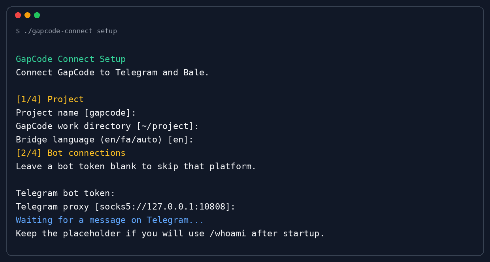

# GapCode Connect

Use [GapCode](https://gapgpt.app/gapcode) from Telegram or Bale while it
continues running on your computer.

This is a fork of [cc-connect](https://github.com/chenhg5/cc-connect) with
native Bale support.

## Install

Install and sign in to GapCode, then run:

```bash
git clone https://github.com/amiralitgh/gapcode-connect.git
cd gapcode-connect
./install.sh --setup
```

The installer builds the connector. If Go is missing, it installs Go with the
normal package manager for your system.

The wizard asks for your project directory, bot tokens, and the user ID allowed
to control each bot.



If you do not know your user ID yet, keep the placeholder, start the connector,
and send `/whoami` to the bot. Put the returned ID into the matching config
entry and restart.

## Start

```bash
set -a
source ~/.cc-connect/secrets.env
set +a
./gapcode-connect --config ~/.cc-connect/config.toml
```

## Telegram

Telegram uses the local SOCKS5 proxy `127.0.0.1:10808` by default. This is the
usual V2Ray port. Remove it in the wizard or config if Telegram works directly.

Create the bot with [@BotFather](https://t.me/BotFather).

## Bale

Create the bot with [Bale BotFather](https://ble.ir/botfather). To add the
command menu, paste [`docs/bale-commands-en.txt`](docs/bale-commands-en.txt)
into BotFather.

## Links

- [GapCode](https://gapgpt.app/gapcode)
- [This fork](https://github.com/amiralitgh/gapcode-connect)
- [Original cc-connect](https://github.com/chenhg5/cc-connect)
- [Bale Bot API](https://docs.bale.ai/)

Keep bot tokens private. They are saved locally in
`~/.cc-connect/secrets.env`.
